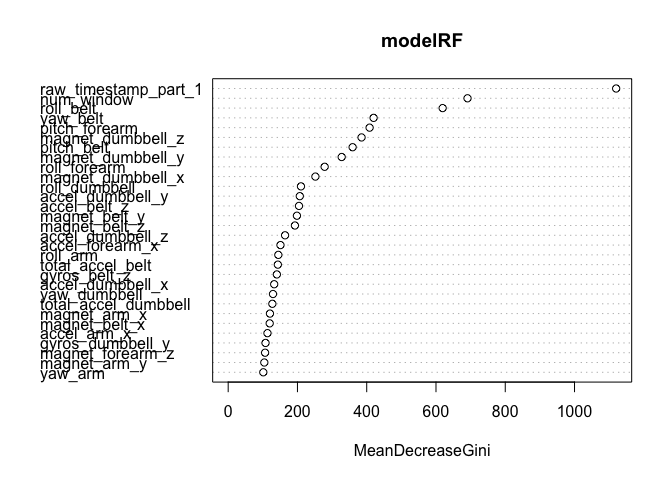

# Using Machine Learning to Predict Weight Lifting Form from Wearable Accelerometer Data
*by MAS May 2019*

## Summary
This report describes the construction of a machine learning classifier to predict how well a specific weight lifting excercise was performed. Six classifications were used to describe weight lifting form:

* Class A:      Proper Form
* Class B:      Elbows Thrown Forward
* Class C:      Lifting Halfway
* Class D:      Lowering Halfway
* Class E:      Hips Thrown Forward

While we often quantify how much of a given activity we perform, we rarely quantify how well we perform it. Maintaining proper form while weight lifting is essential for maximizing muscle growth and minimizing the risk of injury. Wearable accelerometers may assist in monitoring form given a suitable model to predict form from raw accelerometer data. In this report we present a machine learning model based on random forests that results in an estimated out-of-bag error rate of <1% and an out-of-sample accuracy of >99%.

The data for this project are available here: http://web.archive.org/web/20161224072740/http:/groupware.les.inf.puc-rio.br/har. 

## Reading the Training and Test Set
The training and test set have already been separated and stored as two separate ```.csv``` files which can be read and stored as two separate data objects. After placing the ```.csv``` files in the working directory the following R code can be executed to read the data.


```r
# Training
train <- read.csv("pml-training.csv")

# Testing
test <- read.csv("pml-testing.csv")
```

## Preprocessing
The code below shows we have 160 features to work with:

```r
dim(train)
```

```
## [1] 19622   160
```
The last column contains the classification labels

```r
head(train[,160])
```

```
## [1] A A A A A A
## Levels: A B C D E
```
Let's figure out if any features have a lot of missing data. Features that have a lot NA values will not be useful for training. Let's define a threshold of 75% NAs as our cutoff. If a feature has more than 75% NA values, it is discarded. 

```r
# Remove features with >75% NA
pre_train <- train[,colSums(is.na(train)) < 0.75*nrow(train)]
```
Similarly, check and remove blank data. 

```r
# Remove features with >75% blank data
pre_train <- pre_train[,colSums(pre_train == "") < 0.75*nrow(pre_train)]
```
Finally, remove the timestamp and index column since these are arbitrary.

```r
pre_train <- pre_train[,-5]
pre_train <- pre_train[,-1]
```
Before we being model building, let's standardize the data by centering and scaling the non-categorical data and then encoding the categorical data.

```r
library(caret)
# Standardize features
pre_trainObj <- preProcess(pre_train[,-58], method=c("center", "scale"))
pre_train <- predict(pre_trainObj, pre_train[,-58])
pre_train$classe <- train$classe
```
## Model Building
First, partition the training set into trianing and validation sets using a 60/40 split using the ```caret``` library.

```r
set.seed(9876)
inTrain <- createDataPartition(y=pre_train$classe, p=0.60, list=FALSE)
training <- pre_train[inTrain,]
validation <- pre_train[-inTrain,]
```
With this many features, a decision tree might be a good model to start with. Let's first build a tree using all features and then evaluate the generalizability of the model with 10-fold cross validation. This will randomly sample the data without replacement in 10 folds. 

```r
set.seed(1234)
train_control <- trainControl(method="cv", number=10, savePredictions = TRUE)
model <- train(classe ~., data=training, trControl=train_control, method="rpart")
model
```

```
## CART 
## 
## 11776 samples
##    57 predictor
##     5 classes: 'A', 'B', 'C', 'D', 'E' 
## 
## No pre-processing
## Resampling: Cross-Validated (10 fold) 
## Summary of sample sizes: 10599, 10598, 10598, 10597, 10598, 10598, ... 
## Resampling results across tuning parameters:
## 
##   cp          Accuracy   Kappa     
##   0.04022307  0.5340824  0.40081401
##   0.05928651  0.4304363  0.23297082
##   0.11888942  0.3322707  0.07334731
## 
## Accuracy was used to select the optimal model using the largest value.
## The final value used for the model was cp = 0.04022307.
```
The accuracy is not particularly high so let's try random forests to improve model accuracy. Since RF relies on bagging, the out-of-bag error estimate can be used to assess model accuracy.

```r
library(randomForest)
set.seed(5678)
modelRF <- randomForest(classe ~., data=training)
modelRF
```

```
## 
## Call:
##  randomForest(formula = classe ~ ., data = training) 
##                Type of random forest: classification
##                      Number of trees: 500
## No. of variables tried at each split: 7
## 
##         OOB estimate of  error rate: 0.18%
## Confusion matrix:
##      A    B    C    D    E  class.error
## A 3347    1    0    0    0 0.0002986858
## B    1 2278    0    0    0 0.0004387889
## C    0    4 2048    2    0 0.0029211295
## D    0    0    7 1921    2 0.0046632124
## E    0    0    0    4 2161 0.0018475751
```
Now let's apply to the validation set to assess the out of sample error.

```r
valRF <- predict(modelRF, newdata=validation)
confusionMatrix(validation$classe, valRF)
```

```
## Confusion Matrix and Statistics
## 
##           Reference
## Prediction    A    B    C    D    E
##          A 2232    0    0    0    0
##          B    1 1517    0    0    0
##          C    0    8 1358    2    0
##          D    0    0    5 1280    1
##          E    0    0    0    0 1442
## 
## Overall Statistics
##                                           
##                Accuracy : 0.9978          
##                  95% CI : (0.9965, 0.9987)
##     No Information Rate : 0.2846          
##     P-Value [Acc > NIR] : < 2.2e-16       
##                                           
##                   Kappa : 0.9973          
##  Mcnemar's Test P-Value : NA              
## 
## Statistics by Class:
## 
##                      Class: A Class: B Class: C Class: D Class: E
## Sensitivity            0.9996   0.9948   0.9963   0.9984   0.9993
## Specificity            1.0000   0.9998   0.9985   0.9991   1.0000
## Pos Pred Value         1.0000   0.9993   0.9927   0.9953   1.0000
## Neg Pred Value         0.9998   0.9987   0.9992   0.9997   0.9998
## Prevalence             0.2846   0.1944   0.1737   0.1634   0.1839
## Detection Rate         0.2845   0.1933   0.1731   0.1631   0.1838
## Detection Prevalence   0.2845   0.1935   0.1744   0.1639   0.1838
## Balanced Accuracy      0.9998   0.9973   0.9974   0.9988   0.9997
```
We see the accuracy is now quite high (>99%) and can be applied to the test set. We can see a breakdown of the features by importance (only the first 30 features are shown for clarity) as determined by the decrease in Gini Coefficient. This shows how much each variable contributes to the homogeneity of nodes/leaves of the random forest:

```r
varImpPlot(modelRF)
```

<!-- -->

## Preprocessing the Test Set
We will now perform all of the preprocessing on the test set using the criteria established for the training set.

```r
library(dplyr)
pre_train_names <- colnames(pre_train[,-58])
pre_train_ref <- select(pre_train, pre_train_names)
pre_test <- select(test, pre_train_names)

# Standardize data using training set
pre_test <- predict(pre_trainObj, pre_test)
# Ensure indexing is consistent between training and test sets
pre_test <- rbind(pre_train_ref[1,] , pre_test)
pre_test <- pre_test[-1,]
row.names(pre_test) <- 1:20
```

## Applying the Model to the Test Set
The test set is now pre-processed. Let's apply the random forest model:

```r
testRF <- predict(modelRF, newdata=pre_test)
testRF
```

```
##  1  2  3  4  5  6  7  8  9 10 11 12 13 14 15 16 17 18 19 20 
##  B  A  B  A  A  E  D  B  A  A  B  C  B  A  E  E  A  B  B  B 
## Levels: A B C D E
```
